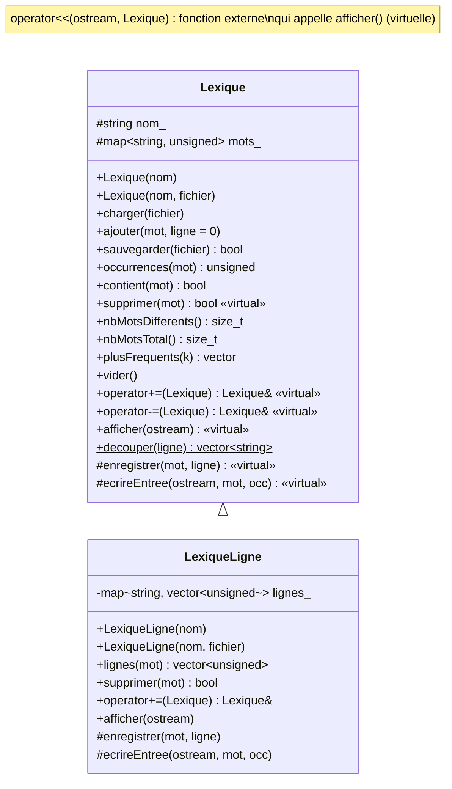

# CPP – TP1 : Lexique de fichiers

## Organisation du dépôt

| Fichier | Rôle |
|---|---|
| `src/lexique.hpp/.cpp` | classe `Lexique` (partie 1) |
| `src/lexique_ligne.hpp/.cpp` | classe `LexiqueLigne` qui hérite de `Lexique` (partie 2) |
| `src/utilitaire.hpp/.cpp` | fonctions utilitaires fournies (`to_lower`, ...) |
| `src/main.cpp` | programme de démonstration sur les deux romans |
| `tests/tests.cpp` | jeux d'essais automatiques (61 assertions) |
| `tests/petit1.txt`, `tests/petit2.txt` | petits textes dont le lexique est connu à la main |
| `data/*.txt` | textes de Victor Hugo fournis |
| `CMakeLists.txt`, `Makefile` | build (CMake ou make) |

Compilation et exécution (C++17) avec CMake :

```sh
cmake -S . -B build && cmake --build build
ctest --test-dir build --output-on-failure   # jeux d'essais
cmake --build build --target run             # démonstration sur data/
```

ou avec le `Makefile` :

```sh
make          # construit ./tp1 et ./tests_tp1
make test     # lance les jeux d'essais
make run      # lance la démonstration sur data/
```

---

## 1. Création d'un lexique

### 1.1 Choix du conteneur

Le lexique associe à chaque mot un nombre d'occurrences : c'est un
**dictionnaire** clé → valeur. On a retenu `std::map<std::string, unsigned>`
(arbre rouge-noir équilibré) :

| Opération | `std::map` | `std::vector` non trié | `std::unordered_map` |
|---|---|---|---|
| ajout d'un mot / recherche / suppression | O(log n) | O(n) | O(1) moyen |
| affichage / sauvegarde triés | O(n), déjà trié | tri O(n log n) | tri O(n log n) |
| fusion `+=` / différence `-=` | **O(n + m)** (parcours parallèle) | O(n·m) | O(m) moyen |

Un `vector` non trié est rédhibitoire : *Les Misérables* contient 575 000 mots
dont 23 000 différents, soit de l'ordre de 10¹⁰ comparaisons. `unordered_map`
serait légèrement plus rapide à la construction, mais `map` garde les mots
triés, ce qui donne un fichier de sortie lisible et permet de fusionner et
de faire la différence de deux lexiques par un simple parcours linéaire.
Mesures (programme `tp1`, `-O2`) :

| | *Les Misérables* | *Notre-Dame de Paris* |
|---|---|---|
| mots au total | 575 119 | 190 274 |
| mots différents | 23 049 | 14 042 |
| temps de construction | ≈ 160 ms | ≈ 50 ms |
| fusion des deux lexiques | ≈ 3 ms | |
| différence des deux lexiques | ≈ 4 ms | |

### 1.2 Découpage du texte en mots

Le fichier est lu ligne par ligne (`std::getline`). Chaque ligne est découpée
par `Lexique::decouper` :

- un mot est une suite de lettres/chiffres ASCII ou d'octets ≥ 0x80 (lettres
  accentuées en UTF-8, ex. `thénardier`) ;
- tout autre caractère est un séparateur : espaces, ponctuation ASCII, `\r`
  des fichiers Windows, mais aussi la ponctuation typographique UTF-8
  (tiret long `—`, apostrophe `’`, guillemets `“ ”`, BOM en tête de fichier) ;
- le mot est mis en minuscules (`util::to_lower`), donc `The` et `the` sont
  le même mot.

Conséquence : `don't` donne `don` et `t` (l'apostrophe est un séparateur).

### 1.3 Diagramme de classes



Opérations demandées :

| Demande | Méthode |
|---|---|
| sauvegarder dans un fichier | `sauvegarder(fichier)` – une ligne `mot occurrences` par mot, triée |
| tester la présence d'un mot et retourner son nombre d'occurrences | `occurrences(mot)` (0 si absent), `contient(mot)` |
| supprimer un mot | `supprimer(mot)` |
| nombre de mots différents | `nbMotsDifferents()` |
| `<<` (externe) | `std::ostream& operator<<(std::ostream&, const Lexique&)` |
| `+=` (interne) | `Lexique::operator+=` |
| `-=` (interne) | `Lexique::operator-=` |

Ajouts : `nbMotsTotal()`, `plusFrequents(k)`, `ajouter(mot)`, `vider()`,
`renommer(nom)`.

`operator<<` est une fonction externe qui appelle la méthode virtuelle
`afficher` : l'affichage est ainsi polymorphe (un `LexiqueLigne` manipulé via
un `Lexique&` affiche aussi ses numéros de ligne).

### 1.4 Algorithme de la fusion (`+=`)

Les deux `map` sont triées : on les parcourt en parallèle comme dans l'étape
de fusion du tri fusion. Un itérateur `it` avance dans le lexique courant
pendant qu'on parcourt l'autre lexique dans l'ordre.

```
fusion(L1 ← L1 + L2) :
    it ← premier élément de L1
    pour chaque (mot, occ) de L2 dans l'ordre croissant :
        tant que it ≠ fin(L1) et clé(it) < mot :
            avancer it
        si it ≠ fin(L1) et clé(it) = mot :
            occ(it) ← occ(it) + occ           // mot commun : on cumule
        sinon :
            insérer (mot, occ) juste avant it // emplace_hint, O(1) amorti
```

Complexité : chaque élément de L1 et de L2 est visité une fois → **O(n + m)**
(contre O(m log(n+m)) avec m insertions indépendantes). `L += L` double les
occurrences (toutes les clés sont communes, aucune insertion pendant le
parcours).

### 1.5 Algorithme de la différence (`-=`)

On ne garde dans L1 que les mots absents de L2 :

```
différence(L1 ← L1 − L2) :
    si L1 et L2 sont le même objet : vider L1 ; fin
    it ← début(L1) ; jt ← début(L2)
    tant que it ≠ fin(L1) et jt ≠ fin(L2) :
        si clé(it) < clé(jt) : avancer it       // mot propre à L1 : conservé
        sinon si clé(jt) < clé(it) : avancer jt // mot propre à L2 : ignoré
        sinon :                                 // mot commun
            mot ← clé(it) ; avancer it          // avancer AVANT d'effacer
            supprimer(mot) ; avancer jt         // supprimer est virtuelle
```

Complexité **O(n + m)**. L'itérateur est avancé avant l'effacement pour ne
pas utiliser un itérateur invalidé. Le cas `L -= L` est traité à part pour la
même raison. L'appel à la méthode virtuelle `supprimer` permet à
`LexiqueLigne` de réutiliser cet algorithme tout en effaçant aussi les
numéros de ligne.

---

## 2. Lexique avec numéros de ligne

### 2.1 Conception

`LexiqueLigne` hérite publiquement de `Lexique` (un lexique avec lignes *est
un* lexique) et ajoute un second dictionnaire
`std::map<std::string, std::vector<unsigned>> lignes_` : pour chaque mot, la
liste triée et sans doublon des lignes où il apparaît.

- Les occurrences restent gérées par la classe de base : aucune donnée n'est
  dupliquée, et toutes les méthodes de `Lexique` (`occurrences`,
  `nbMotsDifferents`, `-=`...) fonctionnent telles quelles.
- Le fichier est lu de haut en bas, donc les numéros de ligne arrivent dans
  l'ordre croissant : `push_back` garde le vecteur trié, et comparer avec
  `back()` suffit pour ne pas enregistrer deux fois la même ligne lorsqu'un mot
  y apparaît plusieurs fois (le nombre d'occurrences, lui, compte toutes les
  apparitions). `vector` est plus compact qu'un `set` et se fusionne en
  temps linéaire.

**Patron « méthode de modèle » (template method).** `Lexique::charger` lit le
fichier avec `getline`, découpe chaque ligne et appelle, pour chaque mot, la
méthode virtuelle protégée `enregistrer(mot, numLigne)` :

- `Lexique::enregistrer` incrémente le compteur et ignore la ligne ;
- `LexiqueLigne::enregistrer` appelle la version de base puis ajoute la ligne.

Un appel virtuel dans un constructeur n'atteint pas la classe dérivée ; c'est
pourquoi le constructeur `LexiqueLigne(nom, fichier)` construit d'abord un
`Lexique` vide puis appelle lui-même `charger(fichier)`.

Méthodes redéfinies :

| Méthode | Comportement dans `LexiqueLigne` |
|---|---|
| `enregistrer` | compte l'occurrence + mémorise la ligne |
| `supprimer` | efface le mot et ses lignes |
| `operator+=` | fusion des occurrences (base) puis union triée des listes de lignes (`std::set_union`) si l'autre lexique est aussi un `LexiqueLigne` (`dynamic_cast`) |
| `operator-=` | **non redéfini** : l'algorithme de base appelle `supprimer` (virtuelle) |
| `afficher` / `ecrireEntree` | ajoutent les numéros de ligne à l'affichage et à la sauvegarde (`mot occ : l1 l2 ...`) |

Le diagramme de classes est donné en 1.3.

Remarque : fusionner des numéros de ligne de deux fichiers différents n'a de
sens que si l'on veut savoir « à quelles lignes, dans l'un ou l'autre texte »
le mot apparaît ; c'est le comportement choisi (union).

---

## 3. Jeux d'essais

### 3.1 Tests automatiques (`make test`)

`tests/petit1.txt` :

```
The cat and the dog.
A dog, a CAT; the end!
Don't stop — the cat’s toy.
```

`tests/petit2.txt` :

```
The bird and the fish.
A cat sees a bird.
```

| Essai | Résultat attendu (calculé à la main) | |
|---|---|---|
| découpage de `Don't stop — the CAT’s toy!` | `don t stop the cat s toy` | ✔ |
| lexique de petit1 | 11 mots différents, 18 au total ; the=4, cat=3, dog=2 | ✔ |
| `occurrences("absent")`, `occurrences("The")` | 0, 0 (mots stockés en minuscules) | ✔ |
| `supprimer("dog")` deux fois | `true` puis `false` ; 10 mots différents | ✔ |
| lexique de petit2 | 7 mots différents, 10 au total | ✔ |
| petit1 `+=` petit2 | 14 mots différents, 28 au total ; the=6, cat=4, bird=2 ; petit2 inchangé | ✔ |
| petit1 `-=` petit2 | 7 mots : dog, end, don, t, stop, s, toy ; bird non ajouté | ✔ |
| `L += vide`, `L -= vide`, `vide += L` | L inchangé / copie de L | ✔ |
| `L += L` puis `L -= L` | occurrences doublées puis lexique vide | ✔ |
| `(A + B) − B` | ne contient aucun mot de B | ✔ |
| sauvegarde de petit2 | `a 2, and 1, bird 2, cat 1, fish 1, sees 1, the 2` (trié) | ✔ |
| sauvegarde dans un dossier inexistant / ouverture d'un fichier inexistant | `false` / exception | ✔ |
| `LexiqueLigne` de petit1 | mêmes occurrences que `Lexique` ; cat → 1 2 3, the → 1 2 3 (pas de doublon), dog → 1 2 | ✔ |
| `LexiqueLigne` `+=` / `-=` | lignes de bird → 1 2 ; lignes des mots retirés effacées | ✔ |
| `-=` via une référence `Lexique&` | lignes effacées aussi (polymorphisme) | ✔ |

Résultat : `61/61 tests reussis` (également vérifié sans erreur avec
AddressSanitizer et UndefinedBehaviorSanitizer).

### 3.2 Démonstration sur les romans (`make run`)

```
=== 1. Creation des lexiques ===
  lesMiserables : 23049 mots differents, 575119 mots au total
  notreDameDeParis : 14042 mots differents, 190274 mots au total
  10 mots les plus frequents de lesMiserables : the(40917) of(19838) and(14876) a(14538) to(13871) ...

=== 3. Recherche / suppression ===
  'valjean' : lesMiserables=1120, notreDameDeParis=0
  'quasimodo' : lesMiserables=0, notreDameDeParis=248
  'paris' : lesMiserables=413, notreDameDeParis=272
  suppression de 'valjean' : ok, occurrences ensuite = 0, mots differents = 23048

=== 4. Fusion (+=) et difference (-=) ===
  fusion : 27039 mots differents, 765393 mots au total
  'paris' dans la fusion : 685 (= 413 + 272)
  propres_lesMiserables : 12997 mots differents, 42585 mots au total
  10 mots les plus frequents de propres_lesMiserables : marius(1374) valjean(1120) cosette(1022) thénardier(530) javert(465) ...
  propres_notreDameDeParis : 3990 mots differents, 8780 mots au total
  10 mots les plus frequents de propres_notreDameDeParis : gringoire(336) quasimodo(248) phoebus(215) archdeacon(209) gypsy(200) ...

=== 6. Lexique avec numeros de ligne ===
  'ananke' : 5 occurrences sur 5 lignes (premieres : 56 9616 10767 11040 11138 ...)
  'quasimodo' : 248 occurrences sur 244 lignes (premieres : 107 1853 2056 2057 ...)
```

Vérifications de cohérence :

- fusion : 575 119 + 190 274 = 765 393 mots au total ✔ ; paris : 413 + 272 = 685 ✔ ;
- différence : les mots les plus fréquents propres à chaque roman sont bien
  les noms de leurs personnages (Marius, Valjean, Cosette… / Gringoire,
  Quasimodo, Phoebus…) ;
- *ANANKE* apparaît bien ligne 56 de *Notre-Dame de Paris* (préface).

Fichiers produits : `lexique_lesMiserables.txt`, `lexique_notreDameDeParis.txt`,
`lexique_propres_notreDameDeParis.txt`, `lexique_lignes_notreDameDeParis.txt`.
