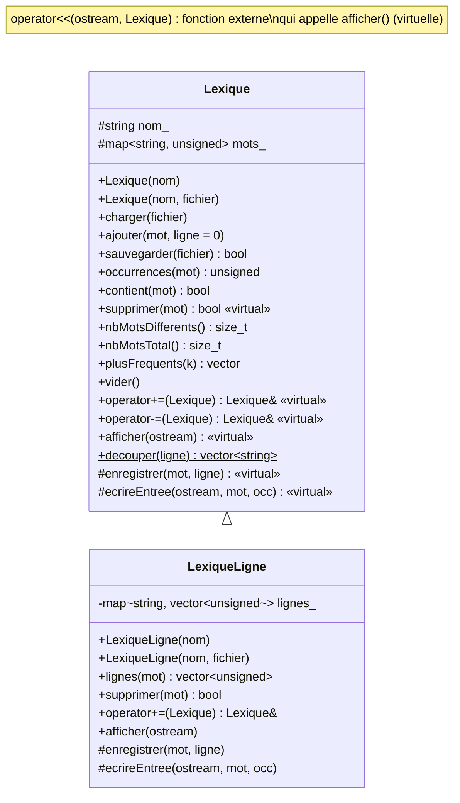

# CPP – TP1 : Lexique de fichiers

## Organisation du dépôt

| Fichier | Rôle |
|---|---|
| `src/lexique.hpp/.cpp` | classe `Lexique` (partie 1) |
| `src/lexique_ligne.hpp/.cpp` | classe `LexiqueLigne` qui hérite de `Lexique` (partie 2) |
| `src/utilitaire.hpp/.cpp` | fonctions utilitaires fournies (`to_lower`, ...) |
| `src/main.cpp` | programme de démonstration sur les deux romans |
| `tests/tests.cpp` | jeux d'essais automatiques (61 assertions) |
| `tests/petit1.txt`, `tests/petit2.txt` | petits textes dont le lexique est connu à la main |
| `bench/benchmark_conteneurs.cpp` | comparaison chiffrée des conteneurs (§ 1.1) |
| `data/*.txt` | textes de Victor Hugo fournis |
| `CMakeLists.txt`, `tests/CMakeLists.txt` | build CMake (projet / tests) |

Compilation et exécution (C++17) avec CMake :

```sh
cmake -S . -B build && cmake --build build
ctest --test-dir build --output-on-failure   # jeux d'essais
cmake --build build --target run             # démonstration sur data/
```

---

## 1. Création d'un lexique

### 1.1 Choix du conteneur

#### Le besoin

Un lexique associe à chaque mot (la **clé**, unique) un nombre d'occurrences
(la **valeur**) : c'est un **dictionnaire**. Les opérations dont on a besoin,
et leur fréquence, guident le choix :

| Opération | Fréquence | Remarque |
|---|---|---|
| « chercher le mot, l'insérer s'il est absent, sinon +1 » | **une fois par mot du texte** (575 119 fois pour *Les Misérables*) | opération critique |
| recherche (`occurrences`) / suppression (`supprimer`) | ponctuelle | |
| affichage `<<` / sauvegarde | une fois | sortie **triée** souhaitée (lisible, comparable d'une exécution à l'autre) |
| fusion `+=` / différence `-=` | une fois | portent sur des lexiques entiers (≈ 14 000 et 23 000 mots) |

Le nombre de mots *différents* (n ≈ 23 000) est très inférieur au nombre de
mots du texte (N ≈ 575 000) : le conteneur ne stocke que n entrées, mais il
est interrogé N fois.

#### Les candidats

| Conteneur | Structure | insérer / chercher / supprimer | parcours trié | `+=` / `-=` |
|---|---|---|---|---|
| `std::vector<pair>` non trié | tableau | O(n) (recherche linéaire) | tri O(n log n) | O(n·m) |
| `std::vector<pair>` trié | tableau + dichotomie | recherche O(log n), **insertion O(n)** (décalage) | O(n), déjà trié | O(n + m) |
| `std::list<pair>` | liste chaînée | O(n) | — | O(n·m) |
| **`std::map<string, unsigned>`** | **arbre binaire de recherche équilibré** (rouge-noir) | **O(log n)** | **O(n), déjà trié** | **O(n + m)** |
| `std::unordered_map<string, unsigned>` | table de hachage | O(1) en moyenne (O(n) au pire) | tri O(n log n) | O(m) en moyenne |

On écarte d'emblée :

- `std::list` : aucun accès direct, recherche linéaire, et un nœud alloué par
  élément ; elle cumule les défauts du vecteur non trié et de la `map` ;
- `std::set<pair>` : l'occurrence ferait partie de la clé et ne pourrait pas
  être modifiée sans retirer puis réinsérer l'élément ;
- un vecteur non trié : chaque mot du texte demande de parcourir le
  lexique, soit N × n / 2 ≈ 6·10⁹ comparaisons dans le pire des cas. C'est le
  cas « rédhibitoire » annoncé par le sujet.

#### Mesures

Pour ne pas choisir sur la seule théorie, `bench/benchmark_conteneurs.cpp`
implémente le lexique avec chacun des quatre candidats restants et mesure
chaque opération sur les vrais textes. Le texte est découpé une seule fois
avant les mesures, pour ne mesurer que le conteneur. Recherches : les 190 274
mots de *Notre-Dame* cherchés dans le lexique des *Misérables*. Fusion et
différence : lexique des *Misérables* ± lexique de *Notre-Dame*.

```sh
cmake --build build --target benchmark && ./build/benchmark data --tout
```

Résultats (g++ 13, `-O2`, Linux, temps en ms) :

| Conteneur | construction | 190 274 recherches | fusion | différence | sortie triée |
|---|---:|---:|---:|---:|---:|
| `vector` non trié | 1 605 | 911 | 298 | 374 | 7 |
| `vector` trié | 797 | 28 | 0,7 | 0,7 | 0,2 |
| **`std::map`** | **89** | **30** | **2,1** | **1,5** | **1,9** |
| `std::unordered_map` | 21 | 6 | 1,2 | 1,4 | 8 |

#### Analyse et choix

- **Vecteur non trié** : le plus lent partout (1,6 s pour construire, presque
  1 s pour les recherches). Le coût est quadratique : il croît avec la taille
  du texte *et* celle du vocabulaire. Sur des textes plus gros il deviendrait
  inutilisable.
- **Vecteur trié** : idéal pour lire (dichotomie, données contiguës,
  fusion et différence très rapides), mais **chaque nouveau mot impose de
  décaler** en moyenne n/2 éléments : construction ≈ 9 fois plus lente
  que la `map`. Il convient à un lexique figé, pas à un lexique construit mot
  après mot puis modifié (`supprimer`, `+=`).
- **`std::unordered_map`** : la plus rapide pour construire et chercher
  (≈ 4 à 5 fois plus que la `map`), mais les mots sont stockés **dans un
  ordre arbitraire** : il faut copier et trier le lexique à chaque affichage
  ou sauvegarde, et l'ordre de sortie dépend de l'implémentation. Son O(1)
  n'est qu'une moyenne qui dépend de la fonction de hachage et du facteur de
  remplissage (re-hachages pendant la construction).
- **`std::map`** : aucune opération n'est mauvaise. Elle garantit O(log n) **au
  pire** (arbre équilibré, ici log₂ 23 000 ≈ 15 comparaisons), et elle
  **maintient les mots triés en permanence**.

**Nous retenons `std::map<std::string, unsigned>`** :

1. **Ordre alphabétique gratuit** : `<<` et `sauvegarder` parcourent
   l'arbre dans l'ordre, sans tri. Les fichiers produits sont lisibles et
   identiques d'une exécution à l'autre, ce qui facilite les jeux d'essais.
2. **Fusion et différence linéaires** : comme les deux lexiques sont triés,
   `+=` et `-=` se font en un seul parcours simultané des deux arbres, comme
   l'étape de fusion du tri fusion (§ 1.4 et 1.5). On peut insérer avec
   `emplace_hint` à l'endroit déjà trouvé.
3. **Complexité garantie** : O(log n) au pire pour insérer, chercher et
   supprimer, sans dépendre d'une fonction de hachage.
4. **Insertion et suppression locales** : contrairement au vecteur trié, rien
   n'est décalé et les itérateurs sur les autres éléments restent valides.
   C'est ce qui permet d'effacer pendant le parcours dans `-=`.
5. **Un coût absolu négligeable** : construire le lexique complet des
   *Misérables* prend moins de 0,1 s avec la `map`, contre 0,02 s avec
   `unordered_map`. Pour un traitement exécuté une fois par fichier, ce gain
   ne compense pas la perte de l'ordre.

`std::unordered_map` serait le bon choix pour un service qui fait des
millions de recherches et n'a jamais besoin de l'ordre alphabétique. Comme
le reste du code passe par les méthodes de `Lexique`, il suffirait de changer
le type `Dictionnaire` (et l'algorithme de `+=`/`-=`) pour basculer.

**Type de la valeur** : `unsigned` (entier non signé de 32 bits). Un nombre
d'occurrences n'est jamais négatif, et 4·10⁹ est largement suffisant
(*the* apparaît 40 917 fois).

#### Temps du programme complet

Mesures avec le programme `tp1` (build Release), découpage du texte compris :

| | *Les Misérables* | *Notre-Dame de Paris* |
|---|---|---|
| mots au total | 575 119 | 190 274 |
| mots différents | 23 049 | 14 042 |
| temps de construction (lecture + découpage + `map`) | ≈ 160 ms | ≈ 50 ms |
| fusion des deux lexiques | ≈ 3 ms | |
| différence des deux lexiques | ≈ 4 ms | |

### 1.2 Découpage du texte en mots

Le fichier est lu ligne par ligne (`std::getline`). Chaque ligne est découpée
par `Lexique::decouper` :

- un mot est une suite de lettres/chiffres ASCII ou d'octets ≥ 0x80 (lettres
  accentuées en UTF-8, ex. `thénardier`) ;
- tout autre caractère est un séparateur : espaces, ponctuation ASCII, `\r`
  des fichiers Windows, mais aussi la ponctuation typographique UTF-8
  (tiret long `—`, apostrophe `’`, guillemets `“ ”`, BOM en tête de fichier) ;
- le mot est mis en minuscules (`util::to_lower`), donc `The` et `the` sont
  le même mot.

Conséquence : `don't` donne `don` et `t` (l'apostrophe est un séparateur).

### 1.3 Diagramme de classes



Opérations demandées :

| Demande | Méthode |
|---|---|
| sauvegarder dans un fichier | `sauvegarder(fichier)` – une ligne `mot occurrences` par mot, triée |
| tester la présence d'un mot et retourner son nombre d'occurrences | `occurrences(mot)` (0 si absent), `contient(mot)` |
| supprimer un mot | `supprimer(mot)` |
| nombre de mots différents | `nbMotsDifferents()` |
| `<<` (externe) | `std::ostream& operator<<(std::ostream&, const Lexique&)` |
| `+=` (interne) | `Lexique::operator+=` |
| `-=` (interne) | `Lexique::operator-=` |

Ajouts : `nbMotsTotal()`, `plusFrequents(k)`, `ajouter(mot)`, `vider()`,
`renommer(nom)`.

`operator<<` est une fonction externe qui appelle la méthode virtuelle
`afficher` : l'affichage est ainsi polymorphe (un `LexiqueLigne` manipulé via
un `Lexique&` affiche aussi ses numéros de ligne).

### 1.4 Algorithme de la fusion (`+=`)

Les deux `map` sont triées : on les parcourt en parallèle comme dans l'étape
de fusion du tri fusion. Un itérateur `it` avance dans le lexique courant
pendant qu'on parcourt l'autre lexique dans l'ordre.

```
fusion(L1 ← L1 + L2) :
    it ← premier élément de L1
    pour chaque (mot, occ) de L2 dans l'ordre croissant :
        tant que it ≠ fin(L1) et clé(it) < mot :
            avancer it
        si it ≠ fin(L1) et clé(it) = mot :
            occ(it) ← occ(it) + occ           // mot commun : on cumule
        sinon :
            insérer (mot, occ) juste avant it // emplace_hint, O(1) amorti
```

Complexité : chaque élément de L1 et de L2 est visité une fois → **O(n + m)**
(contre O(m log(n+m)) avec m insertions indépendantes). `L += L` double les
occurrences (toutes les clés sont communes, aucune insertion pendant le
parcours).

### 1.5 Algorithme de la différence (`-=`)

On ne garde dans L1 que les mots absents de L2 :

```
différence(L1 ← L1 − L2) :
    si L1 et L2 sont le même objet : vider L1 ; fin
    it ← début(L1) ; jt ← début(L2)
    tant que it ≠ fin(L1) et jt ≠ fin(L2) :
        si clé(it) < clé(jt) : avancer it       // mot propre à L1 : conservé
        sinon si clé(jt) < clé(it) : avancer jt // mot propre à L2 : ignoré
        sinon :                                 // mot commun
            mot ← clé(it) ; avancer it          // avancer AVANT d'effacer
            supprimer(mot) ; avancer jt         // supprimer est virtuelle
```

Complexité **O(n + m)**. L'itérateur est avancé avant l'effacement pour ne
pas utiliser un itérateur invalidé. Le cas `L -= L` est traité à part pour la
même raison. L'appel à la méthode virtuelle `supprimer` permet à
`LexiqueLigne` de réutiliser cet algorithme tout en effaçant aussi les
numéros de ligne.

---

## 2. Lexique avec numéros de ligne

### 2.1 Conception

`LexiqueLigne` hérite publiquement de `Lexique` (un lexique avec lignes *est
un* lexique) et ajoute un second dictionnaire
`std::map<std::string, std::vector<unsigned>> lignes_` : pour chaque mot, la
liste triée et sans doublon des lignes où il apparaît.

- Les occurrences restent gérées par la classe de base : aucune donnée n'est
  dupliquée, et toutes les méthodes de `Lexique` (`occurrences`,
  `nbMotsDifferents`, `-=`...) fonctionnent telles quelles.

**Pourquoi une seconde `map` séparée plutôt que changer la valeur de la
première ?** On aurait pu remplacer `map<string, unsigned>` par
`map<string, Entree>` avec `Entree = {occurrences, lignes}`, mais la classe de
base devrait alors connaître les lignes. Avec un dictionnaire ajouté dans la
classe dérivée, `Lexique` ne change pas et `LexiqueLigne` ne fait qu'*étendre*
son comportement. Le surcoût est une seconde recherche dans un arbre de
14 000 mots (≈ 14 comparaisons) par mot lu : la construction passe de ≈ 50 ms
à ≈ 95 ms pour *Notre-Dame de Paris*. Ce coût reste acceptable. On
choisit encore une `map` (et non une `unordered_map`) pour les mêmes raisons
qu'au § 1.1 : `ecrireEntree` et `afficher` parcourent les mots dans l'ordre.

**Pourquoi un `std::vector<unsigned>` pour les numéros de ligne ?**

| Candidat | ajout d'une ligne | doublons | mémoire | union de deux listes |
|---|---|---|---|---|
| **`std::vector<unsigned>`** | **O(1) amorti** (`push_back`) | test de `back()`, O(1) | **4 octets par ligne, contigus** | `std::set_union` O(a + b) |
| `std::set<unsigned>` | O(log k) | évités automatiquement | ≈ 40 octets par ligne (nœud d'arbre) | O(a + b) |
| `std::list<unsigned>` | O(1) | test du dernier, O(1) | ≈ 24 octets par ligne | `merge` O(a + b) |

Le fichier est lu de haut en bas, donc les numéros de ligne arrivent **déjà
dans l'ordre croissant**. Il suffit d'ajouter en fin de vecteur (`push_back`)
pour le garder trié. Pour ne pas enregistrer deux fois la même ligne
lorsqu'un mot y apparaît plusieurs fois, il suffit de comparer avec `back()`
(le nombre d'occurrences, lui, compte toutes les apparitions). Le `set`
garantirait l'ordre et l'unicité, mais ici cette garantie ne sert à rien et
coûte environ dix fois plus de mémoire, pour 176 726 numéros de ligne stockés sur *Notre-Dame de Paris*. Pour
un ajout manuel hors ordre (`ajouter(mot, ligne)`), `enregistrer` insère au bon
endroit par dichotomie (`lower_bound`), donc le vecteur reste toujours trié et
sans doublon.

**Patron « méthode de modèle » (template method).** `Lexique::charger` lit le
fichier avec `getline`, découpe chaque ligne et appelle, pour chaque mot, la
méthode virtuelle protégée `enregistrer(mot, numLigne)` :

- `Lexique::enregistrer` incrémente le compteur et ignore la ligne ;
- `LexiqueLigne::enregistrer` appelle la version de base puis ajoute la ligne.

Un appel virtuel dans un constructeur n'atteint pas la classe dérivée ; c'est
pourquoi le constructeur `LexiqueLigne(nom, fichier)` construit d'abord un
`Lexique` vide puis appelle lui-même `charger(fichier)`.

Méthodes redéfinies :

| Méthode | Comportement dans `LexiqueLigne` |
|---|---|
| `enregistrer` | compte l'occurrence + mémorise la ligne |
| `supprimer` | efface le mot et ses lignes |
| `operator+=` | fusion des occurrences (base) puis union triée des listes de lignes (`std::set_union`) si l'autre lexique est aussi un `LexiqueLigne` (`dynamic_cast`) |
| `operator-=` | **non redéfini** : l'algorithme de base appelle `supprimer` (virtuelle) |
| `afficher` / `ecrireEntree` | ajoutent les numéros de ligne à l'affichage et à la sauvegarde (`mot occ : l1 l2 ...`) |

Le diagramme de classes est donné en 1.3.

Remarque : fusionner des numéros de ligne de deux fichiers différents n'a de
sens que si l'on veut savoir « à quelles lignes, dans l'un ou l'autre texte »
le mot apparaît ; c'est le comportement choisi (union).

---

## 3. Jeux d'essais

### 3.1 Tests automatiques (`ctest`)

`tests/petit1.txt` :

```
The cat and the dog.
A dog, a CAT; the end!
Don't stop — the cat’s toy.
```

`tests/petit2.txt` :

```
The bird and the fish.
A cat sees a bird.
```

| Essai | Résultat attendu (calculé à la main) | |
|---|---|---|
| découpage de `Don't stop — the CAT’s toy!` | `don t stop the cat s toy` | ✔ |
| lexique de petit1 | 11 mots différents, 18 au total ; the=4, cat=3, dog=2 | ✔ |
| `occurrences("absent")`, `occurrences("The")` | 0, 0 (mots stockés en minuscules) | ✔ |
| `supprimer("dog")` deux fois | `true` puis `false` ; 10 mots différents | ✔ |
| lexique de petit2 | 7 mots différents, 10 au total | ✔ |
| petit1 `+=` petit2 | 14 mots différents, 28 au total ; the=6, cat=4, bird=2 ; petit2 inchangé | ✔ |
| petit1 `-=` petit2 | 7 mots : dog, end, don, t, stop, s, toy ; bird non ajouté | ✔ |
| `L += vide`, `L -= vide`, `vide += L` | L inchangé / copie de L | ✔ |
| `L += L` puis `L -= L` | occurrences doublées puis lexique vide | ✔ |
| `(A + B) − B` | ne contient aucun mot de B | ✔ |
| sauvegarde de petit2 | `a 2, and 1, bird 2, cat 1, fish 1, sees 1, the 2` (trié) | ✔ |
| sauvegarde dans un dossier inexistant / ouverture d'un fichier inexistant | `false` / exception | ✔ |
| `LexiqueLigne` de petit1 | mêmes occurrences que `Lexique` ; cat → 1 2 3, the → 1 2 3 (pas de doublon), dog → 1 2 | ✔ |
| `LexiqueLigne` `+=` / `-=` | lignes de bird → 1 2 ; lignes des mots retirés effacées | ✔ |
| `-=` via une référence `Lexique&` | lignes effacées aussi (polymorphisme) | ✔ |

Résultat : `61/61 tests reussis` (également vérifié sans erreur avec
AddressSanitizer et UndefinedBehaviorSanitizer).

### 3.2 Démonstration sur les romans (cible `run`)

```
=== 1. Creation des lexiques ===
  lesMiserables : 23049 mots differents, 575119 mots au total
  notreDameDeParis : 14042 mots differents, 190274 mots au total
  10 mots les plus frequents de lesMiserables : the(40917) of(19838) and(14876) a(14538) to(13871) ...

=== 3. Recherche / suppression ===
  'valjean' : lesMiserables=1120, notreDameDeParis=0
  'quasimodo' : lesMiserables=0, notreDameDeParis=248
  'paris' : lesMiserables=413, notreDameDeParis=272
  suppression de 'valjean' : ok, occurrences ensuite = 0, mots differents = 23048

=== 4. Fusion (+=) et difference (-=) ===
  fusion : 27039 mots differents, 765393 mots au total
  'paris' dans la fusion : 685 (= 413 + 272)
  propres_lesMiserables : 12997 mots differents, 42585 mots au total
  10 mots les plus frequents de propres_lesMiserables : marius(1374) valjean(1120) cosette(1022) thénardier(530) javert(465) ...
  propres_notreDameDeParis : 3990 mots differents, 8780 mots au total
  10 mots les plus frequents de propres_notreDameDeParis : gringoire(336) quasimodo(248) phoebus(215) archdeacon(209) gypsy(200) ...

=== 6. Lexique avec numeros de ligne ===
  'ananke' : 5 occurrences sur 5 lignes (premieres : 56 9616 10767 11040 11138 ...)
  'quasimodo' : 248 occurrences sur 244 lignes (premieres : 107 1853 2056 2057 ...)
```

Vérifications de cohérence :

- fusion : 575 119 + 190 274 = 765 393 mots au total ✔ ; paris : 413 + 272 = 685 ✔ ;
- différence : les mots les plus fréquents propres à chaque roman sont bien
  les noms de leurs personnages (Marius, Valjean, Cosette… / Gringoire,
  Quasimodo, Phoebus…) ;
- *ANANKE* apparaît bien ligne 56 de *Notre-Dame de Paris* (préface).

Fichiers produits : `lexique_lesMiserables.txt`, `lexique_notreDameDeParis.txt`,
`lexique_propres_notreDameDeParis.txt`, `lexique_lignes_notreDameDeParis.txt`.

---

## 4. Utilisation de l'intelligence artificielle

### 4.1 Outil et déroulement

Le développement a été fait avec **Claude Code** (assistant de
programmation d'Anthropic), utilisé comme agent : il lit les fichiers,
écrit le code, le compile et l'exécute dans un environnement Linux, puis
pousse les modifications sur le dépôt GitHub. Le travail s'est fait en
plusieurs demandes successives :

| Étape | Demande faite à l'IA | Ce que l'IA a produit |
|---|---|---|
| 1 | « fais le TP en cpp », avec le sujet PDF et l'archive fournie (`utilitaire.cpp/.hpp`, textes) | analyse du sujet et des fichiers ; classes `Lexique` et `LexiqueLigne`, programme de démonstration, jeux d'essais, première version du rapport |
| 2 | « fais-moi un CMake pour build le projet » | `CMakeLists.txt` (bibliothèque, exécutables, `ctest`, cible `run`) |
| 3 | « enlève le Makefile, juste un ou deux CMakeLists pour les tests » | suppression du `Makefile`, création de `tests/CMakeLists.txt` |
| 4 | « justifie bien les choix pour les `map` et indique comment on a utilisé l'IA » | programme de mesure `bench/benchmark_conteneurs.cpp`, réécriture des § 1.1 et 2.1, cette section |

### 4.2 Ce que l'IA a fait

- **Conception** : choix de `std::map` et de `std::vector` pour les lignes,
  hiérarchie `Lexique` → `LexiqueLigne`, utilisation d'une méthode virtuelle
  (`enregistrer`) appelée pendant la lecture du fichier (patron « méthode de
  modèle »).
- **Code** : tout le code de `src/` (hors `utilitaire.*`, fourni), les tests
  et le programme de mesure.
- **Analyse des données** : l'IA a examiné les fichiers fournis avant
  d'écrire le découpage en mots. Elle a ainsi repéré qu'ils sont en UTF-8
  avec fins de ligne Windows (CRLF), avec un BOM au début de
  *Notre-Dame de Paris* et une ponctuation typographique (`—`, `’`, `“ ”`).
  Sans traitement particulier, ces caractères auraient été collés aux mots
  (`cat’s` au lieu de `cat` + `s`).
- **Rédaction** : la structure du rapport, les tableaux de complexité, le
  pseudo-code et le diagramme de classes.

### 4.3 Comment le résultat a été vérifié

Le code produit par une IA peut se compiler et sembler correct tout en étant
faux. On ne s'est donc pas fié à sa seule lecture :

- **Jeux d'essais à résultats calculés à la main** (`tests/petit1.txt`,
  `tests/petit2.txt`) : les valeurs attendues (11 mots différents, 18 au
  total, `the` = 4…) ont été comptées sur le texte. Les tests vérifient
  aussi les cas limites (lexique vide, `L += L`, `L -= L`, fichier
  inexistant). Résultat : 61 assertions réussies.
- **Outils d'analyse dynamique** : les tests ont été recompilés avec
  AddressSanitizer et UndefinedBehaviorSanitizer (`-fsanitize=address,undefined`)
  pour détecter les accès mémoire invalides, notamment l'effacement dans
  une `map` pendant son parcours dans `-=`. Aucune erreur n'a été signalée.
- **Cohérence sur les vrais textes** : total de la fusion = somme des totaux
  (575 119 + 190 274 = 765 393) ; `paris` : 413 + 272 = 685 ; les mots
  propres à chaque roman après `-=` sont bien les noms des personnages ; le
  mot *ANANKE* est trouvé à la ligne 56 de *Notre-Dame*, ce que l'on vérifie
  en ouvrant le fichier.
- **Mesures plutôt qu'affirmations** : la première version du rapport
  affirmait que `unordered_map` serait « légèrement » plus rapide que `map`.
  Le programme de mesure a montré un écart de 4 à 5 fois à la construction.
  Le rapport a été corrigé et la justification de `map` repose maintenant
  sur l'ordre des mots et la fusion linéaire, pas sur la vitesse.
- **Compilation sans avertissement** avec `-Wall -Wextra -Wpedantic`.

### 4.4 Limites et regard critique

- L'IA a fait des **choix de conception que le sujet laissait libres**. Par
  exemple, l'apostrophe sépare les mots (`don't` → `don` + `t`), la
  fusion de deux `LexiqueLigne` fait l'union des numéros de ligne, et
  `L -= L` vide le lexique. Ces choix sont discutables et sont expliqués
  dans le rapport pour pouvoir être contestés.
- Les erreurs de compilation rencontrées pendant le développement (par
  exemple un mélange d'itérateurs `const` et non `const` dans le programme
  de mesure) ont été corrigées par l'IA à partir des messages du
  compilateur.
- L'IA va vite pour écrire du code standard et tester de nombreux cas. En
  revanche, **comprendre le code reste indispensable** pour pouvoir
  l'expliquer, le modifier et repérer ses erreurs. Le code doit donc être
  relu jusqu'à pouvoir justifier chaque choix : complexité des opérations sur
  `std::map`, invalidation des itérateurs, appels virtuels pendant la
  construction d'un objet.
